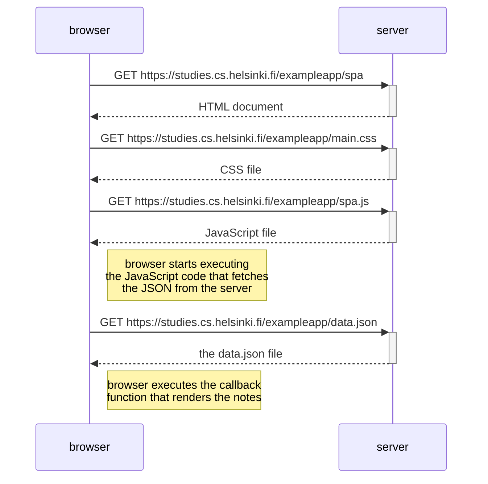

```mermaid
  sequenceDiagram
    participant B as browser
    participant S as server

    B->>+S: GET https://studies.cs.helsinki.fi/exampleapp/spa
    S-->>-B: HTML document

    B->>+S: GET https://studies.cs.helsinki.fi/exampleapp/main.css
    S-->>-B: CSS file

    B->>+S: GET https://studies.cs.helsinki.fi/exampleapp/spa.js
    S-->>-B: JavaScript file

    Note right of B: browser starts executing<br/>the JavaScript code that fetches<br/>the JSON from the server

    B->>+S: GET https://studies.cs.helsinki.fi/exampleapp/data.json
    S-->>-B: the data.json file

    Note right of B: browser executes the callback<br/>function that renders the notes
```
