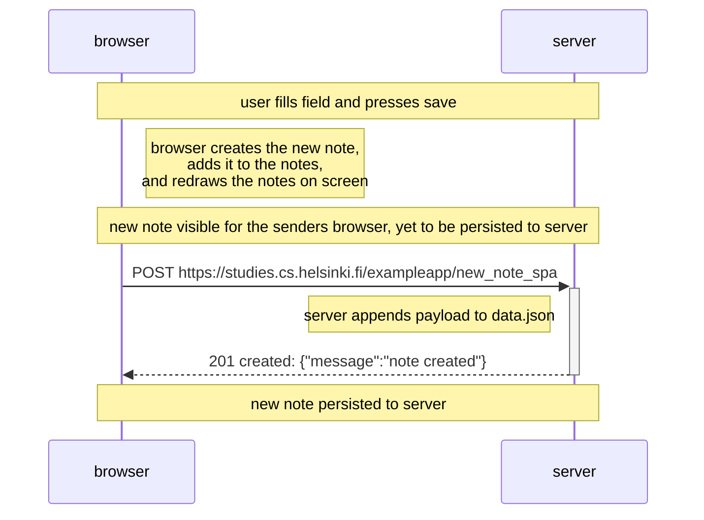

```mermaid
  sequenceDiagram
    participant B as browser
    participant S as server
  
    Note over S,B: user fills field and presses save

    Note right of B: browser creates the new note,<br/>adds it to the notes,<br/>and redraws the notes on screen

    Note over S,B: new note visible for the senders browser, yet to be persisted to server

    B->>+S: POST https://studies.cs.helsinki.fi/exampleapp/new_note_spa
    Note left of S: server appends payload to data.json
    S-->>-B: 201 created: {"message":"note created"}

    Note over S,B: new note persisted to server
```
