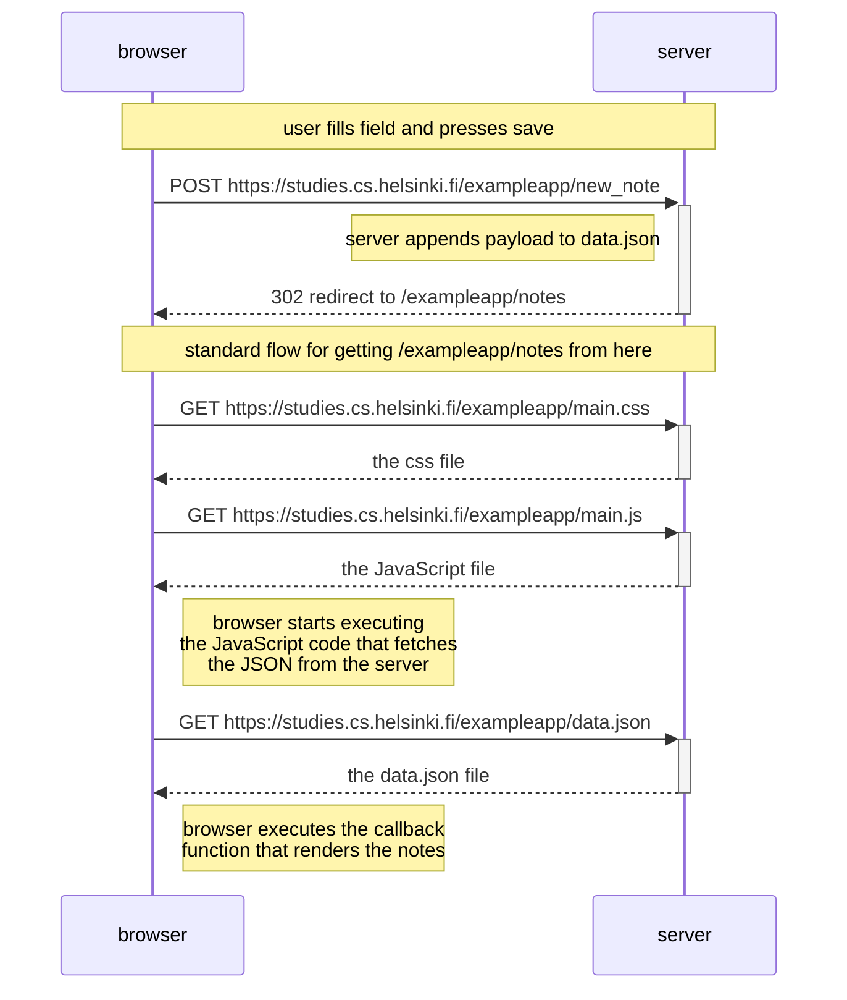

```mermaid
  sequenceDiagram
    participant B as browser
    participant S as server
  
    Note over S,B: user fills field and presses save

    B->>+S: POST https://studies.cs.helsinki.fi/exampleapp/new_note
    Note left of S: server appends payload to data.json
    S-->>-B: 302 redirect to /exampleapp/notes

    Note over S,B: standard flow for getting /exampleapp/notes from here

    B->>+S: GET https://studies.cs.helsinki.fi/exampleapp/main.css
    S-->>-B: the css file

    B->>+S: GET https://studies.cs.helsinki.fi/exampleapp/main.js
    S-->>-B: the JavaScript file

    Note right of B: browser starts executing<br/>the JavaScript code that fetches<br/>the JSON from the server

    B->>+S: GET https://studies.cs.helsinki.fi/exampleapp/data.json
    S-->>-B: the data.json file

    Note right of B: browser executes the callback<br/>function that renders the notes
```
